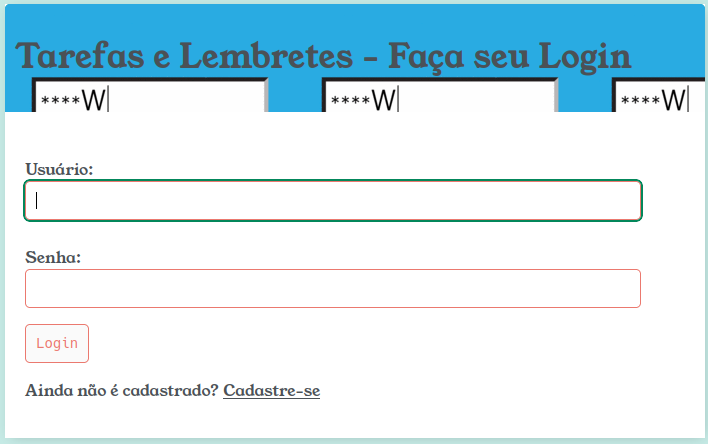
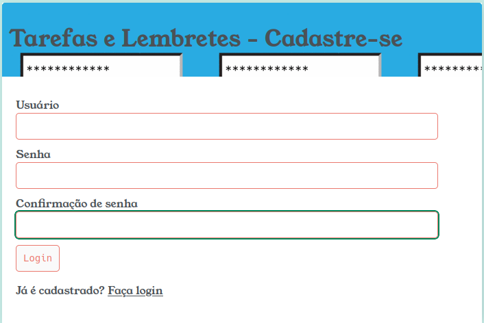
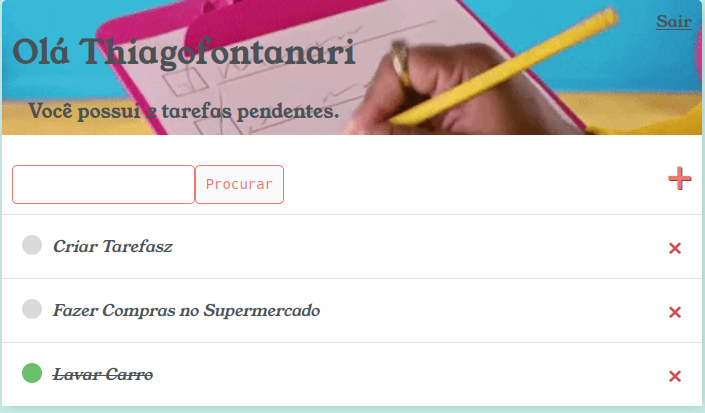
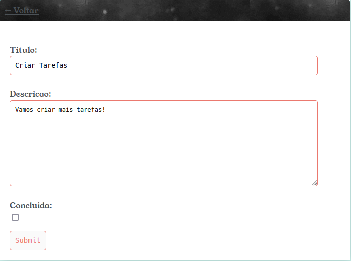

# TAREFAS E LEMBRETES

## INTRODUÇÃO

Tarefas e Lembretes é uma aplicação simples para registro de afazeres diversos, o clássico "To do List". Foi desenvolvida com o framework Django v.4.2.6, e utilizando o SGBD SQLite para persistência de dados. No frontend são utilizadas técnicas básicas de HTML e CSS.

## INSTALAÇÃO

Para a instalação, clonar o presente repositório na máquina local com o comando `git clone`.

Em seguida, realizar a instalação das dependências listadas em requirements.txt com o comando `pip install -r requirements.txt`

Feito isto, será necessário criar as tabelas no SGBD para persistência de dados. Primeiro, para criar o arquivo de migração do Django com base nos modelos definidos em models.py, rodar o comando `python manage.py makemigrations`, depois, para aplicar as migrações ao SGBD, rodar `python manage.py migrate`. Lembre-se de estar com a sessão do terminal aberta no mesmo diretório do arquivo "manage.py".

Assim, a aplicação deve estar pronta para utilização. Podemos iniciar o servidor de desenvolvimento do Django com `python manage.py runserver`. Por padrão, o Django inicializará o servidor na porta 8000, para especificar uma porta, basta incluir o número da porta desejada como argumento como, por exemplo, `python manage.py runserver 8080`. 

## USO

Ao acessar a aplicação, o usuário é direcionado à tela de login onde, caso o usuário ainda não seja cadastrado, existe o botão "Cadastre-se" para criação de uma conta de usuário.

    

Para utilizar a aplicação, é necessário realizar a criação de um usuário, que será protegido por senha. Cada usuário poderá ver somente suas próprias tarefas, bem como poderá somente criar tarefas para si mesmo. 

    

Uma vez efetuado o login, a lista de tarefas é apresentada ao usuário. Nela é possível adicionar uma nova tarefa através do botão "+", excluir tarefas antigas no botão "X" ao lado do nome da tarefa que será exluída e atualizar informações sobre determinada tarefa clicando no nome da tarefa. As tarefas são listadas por ordem de data de criação e, as tarefas que são marcadas como concluídas, aparecem no final da lista, com o título tachado e sinalizada em verde. Existe também uma barra de pesquisas, para facilitar a utilização quando houver uma lista com muitos itens.

    

Clicando sobre o título da tarefa, é possível atualizar suas informações. No campo "Descrição" é possível inserir detalhes sobre a tarefa, e o checkbox "Concluído" atualiza o status da tarefa.

    

## LICENSA

Consulte a [licensa](LICENSE.txt) para mais detalhes. 
